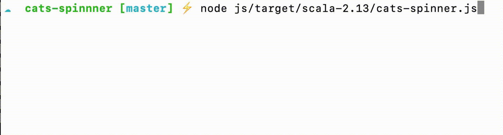
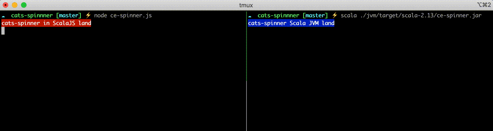
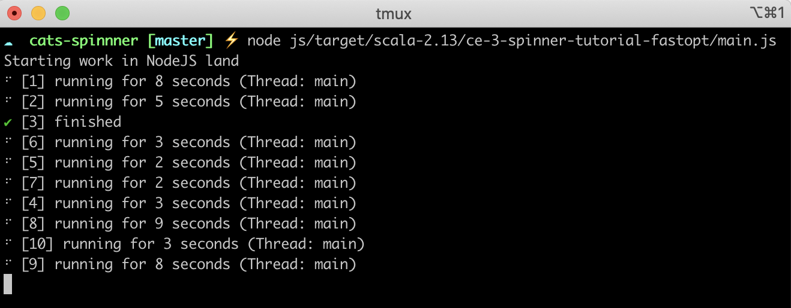

# Cats Spinner

An asynchronous spinner designed for the IO datatype built using [Cats Effect][ce3] (CE3) for both Scala and ScalaJS.

Built using functional style composition it's a simple wrapper type that augments IOs capabilities without interfering with IOs
operations and handles automatic spinner resource closure using `bracket`. 



I haven't quite figured out how to publish things yet and this project is relatively small so you could just get away with
copying and pasting the [Spinner][spinnerlib] file if you want to give it a go yourself. The build instructions in this repo are
for both Scala and ScalaJS so the option is yours.

A nice property of cespinner is the ability to run multiple spinners concurrently and understand what they are doing and
where they are running (on NodeJS thats the main thread and in JVM land that _could_ be the main thread, or it could be somewhere
else as we'll soon see!). It also self-contains all spinner logic within the `withSpinner` function itself allowing the caller to
specify how to represent success and failure states, without ever needing to interact with the spinner resource directly.

## Motivation

I picked up Scala a few weeks ago and was intrigued by the newly minted [`cats-effect 3`][ce3] library. I wanted to explore some
of the asynchronous capabilities CE3 had to offer and apply them to a trivial concurrency problem with functional concepts.

A nice side benefit is that you now the ability to visualise what your fibers are doing, both synchronously and concurrently. The
project makes use of bracket, refs, timers, uniques (tokens), and, most famously, the newly minted concurrent queue
implementation all available from [CE3][ce3]! The core implementation of cespinner is available in [`this file`][spinnerlib].

## Basics

```scala
override def run(args: List[String]): IO[ExitCode] = {
  for {
    /* Some Sync IOs with basic messages */
    - <- IO.unit.withSpinner()                                             /* quick message with default success/failure output */
    - <- IO.unit.withSpinner("quick output message")                       /* same as onStart = "quick..." */
    _ <- IO.sleep(2.seconds).withSpinner(withMessageRef = mutableMessage), /* mutable message example */
    _ <- IO.sleep(2.seconds).withSpinner(
          onStart = "..", onEnd = "..", onFail = ".."                      /* basic start/end/failure messages */

          /* optional advanced handlers */
           onSuccessCallback:                                              /* some callback: Option[(A) => String]                               */ ,
           onErrorCallback:                                                /* some error callback with a Throwable Option[(Throwable) => String] */ ,
           withMessageRef:                                                 /* some mutable message Ref[IO, String]                               */ ,
         )
    /* Concurrent IOs via parMapN. `withSpinner` deals with how to present these to the console (ScalaJVM/ScalaJS) */
    _ <- (
        IO.sleep(5.seconds).withSpinner("I should change in 5 seconds"),
        /* ...6 more concurrent fibers */
        ).parMapN((_,_,_,_,_,_,_) => ExitCode.Success)
  }
}
```

## Examples and comparison

Lets kick of 10 worker fibers concurrently that:
1. Print the name of the current thread attached to that fiber
2. Index the worker from 1-10
3. Add a random sleep time for each running fiber not exceeding 10 seconds

> Spoiler: Here's what the two versions look like side-by-side.



### Scala JVM example

The complete code for this is as follows:

```scala
import cats.effect._
import cats.implicits._
import scala.concurrent.duration._
import com.cespinner.Spinner._

object IOSpinner extends IOApp {
  override def run(args: List[String]): IO[ExitCode] = {
    for {
      _ <- IO.println("Starting work in Scala land")
      fibs <- (1 to 10).toList.map((_, Random.nextInt(10))).traverse {
        case (idx, rnd) => IO.cede >> IO.sleep(rnd.seconds).withSpinner(
          s"[${idx}] running for ${rnd} seconds (Thread: ${Thread.currentThread.getName})",
          onEnd=s"[${idx}] finished"
        ).start
      }
      _ <- fibs.traverse(_.join)
      _ <- IO.unit.withSpinner("Finished countdown") >> IO.sleep(100.millis) >> IO.println("Scala version done!")
    } yield (ExitCode.Success)
  }
}
```
### Observations

- Forcing the IO runtime to cede execution for 10 fibers actually creates 3 JVM threads for our fibers to run on. Cool! We don't
  need any special magic here for threads. All we really care about is _concurrency_. In essence, the interleaving of our fibers
- Our concurrent `workers` are executed non-deterministically as you can see from the `[worker#]` output
- Ceding execution of our fiber doesn't _always_ run that fiber on a separate thread. The IO runtime decides whats suitable here


In this example we've asked the IORuntime to `cede` execution of a number of our fibers to another thread off the main compute
thread. In practice we should let the IO Runtime decide when and where things are run, given these are lower level details we
shouldn't really be concerned with, unless of course we _know_ in advance a given operation will be expensive or compute heavy.
In such situations we can always ask IO runtime to suspend our execution across another thread via `evalOn`, `cede` and `blocking`
where supported.

 Heres a snippet after a few hundred milliseconds when the program is first kicked off. Notice the thread names.

 ```
 ☁  cats-spinnner [master] ⚡ scala ./target/scala-2.13/ce-spinner.jar
 ⠹ [1] running for 6 seconds (Thread: io-compute-3)
 ⠹ [4] running for 6 seconds (Thread: io-compute-0)
 ⠹ [2] running for 2 seconds (Thread: io-compute-3)
 ⠹ [3] running for 8 seconds (Thread: io-compute-1)
 ⠹ [5] running for 1 seconds (Thread: io-compute-0)
 ✔ [6] finished
 ⠹ [7] running for 9 seconds (Thread: io-compute-1)
 ⠹ [8] running for 4 seconds (Thread: io-compute-1)
 ⠹ [9] running for 9 seconds (Thread: io-compute-1)
 ⠹ [10] running for 1 seconds (Thread: io-compute-1)
 ```

### ScalaJS/NodeJS example
Lets see how our ScalaJS example stacks up:
```scala
override def run(args: List[String]): IO[ExitCode] = {
  for {
    _ <- IO.println("Starting work in NodeJS land")
    fibs <- (1 to 10).toList.map((_, Random.nextInt(10))).traverse {
      case (idx, rnd) => IO.sleep(rnd.seconds).withSpinner(
        s"[${idx}] running for ${rnd} seconds (Thread: ${Thread.currentThread.getName})",
        onEnd=s"[${idx}] finished"
      ).start
    }
    _ <- fibs.traverse(_.join)
    _ <- IO.unit.withSpinner("Finished countdown") >> IO.sleep(100.millis) >> IO.println("ScalaJS/ Node version done!")
  } yield (ExitCode.Success)
}
```
This is the same code as we saw before, but without `ceding` execution. For a single-threaded runtime this would essentially be a
no-op. Nevertheless, there's no observable difference between these running two programs even though one is compiled to a `jar`
file with full JVM capabilities including user-space multi-threading, and the other to a `js` file to be run by NodeJS.




#### Observations

Both are non-deterministic and concurrent as observed by the `[worker#]` prefix irrespective of threads. The Scala version takes a
little while longer to get started due to JVMs cold start nature, whereas the Node version is almost instantaneous. This _may_ be
a deciding factor when building out CLI apps. However, CLI apps that are compute heavy will excel in the JVM version given its
capabilities for suspending execution across multiple threads. For typical IO bound work, both JVM and ScalaJS are fine choices.

ScalaJS would be a great choice for CLI apps wishing to integrate with the wider Node ecosystem.

---

The next portion is pretty heavy in text and its mostly my brain droppings along the way. Feel free to give it a read if you want --
it mostly highlights some of the drawbacks to the imperative approach to building spinners and some of the capabilities that
functional programming give us when reasoning about composition and state management.
<details>

<summary>The rationale and design decisions</summary>

## CE-3 resources
The project makes use of queues, refs, brackets, tokens, timers all available from the newly minted Cats Effect 3.x
library. It makes heavy use of the `Async` typeclass and abstracts over the effect type where appropriate as well.

- `BoundedConcurrentQueue`: managing message passing from _n_ number of producers. Each IO that calls `withSpinner` is its own producer. We've
  got this configured to a boundedQueue so producers are _semanticly blocked_ until a message is consumed. They are guaranteed to
  be cancelled on IO completion via `bracket`.
- `Refs`: Managing message state updates. This allows callers to pass a `ref` value that can be updated with a frequency of
  their liking.  We also put our StateMap behind a ref so we know for sure our state updates are atomic. This is especially
  important for mutli-spinners as we need to know exactly how many messages we've got in flight so we can 1) Clear the stdout
  buffer to exactly **messages.size** and 2) ensure success/ failure states are propagated back to producers at just the right
  time before offering them to the queue. Off-by-one errors here will render concurrent spinners pointless and unusable.

  > Thought experiment: If we have 3
  concurrent fiber messsages received and split by line, and we only remove two messages, what does our output produce?
  Conversely, if we have 2 messages in flight and we remove 3 of these due to state inconsistency, what happens? Recall for each
  interval we write to stdout/stderr we need to track what line we were on previously, and write our new updates at exactly that
  point.

This is how `withSpinner`knows how many lines to clear, the ordering of concurrent messages and identity via `token`.
- `Unique/ Realtime`: These two primitives allow us to keep track of _when_ items are added to our StateMap for ordering, while giving
each unique runner their own `id` attribute
- `Bracket/BracketFull`: This is where cats-effect really shines. We've got full resource control and cancellation builin as a
primative to our library. The power this gives us is the assurance our spinner resources are *always* closed while allowing the
caller to specify _what_ to do in the instance of a failure/ success. Callers don't need to think about closing off spinners/
wrapping them in try/catches or lifting their assignment out of a `try` block just to update their status in a `catch` block.

All this happens transparently, without leaking any spinner related references to the caller. In fact, our IOs don't even know
about them! We've got the guarantees that bracket will always return the intended success/failure `as-is` while at the same time
providing utilities for callers to specify how to update a spinner message on success and failure.

```scala
implicit class SpinnerOp[A](ioa: IO[A]) {

  def withSpinner(
    /* Trivial success/ failure messages */
    onStart: String = "...",
    onEnd: String = "...",
    onFail: String = "Failed..",

  /* Success/ failure messages with IO context */
    onSuccessCallback: Option[(A) => String] = None,
    onErrorCallback: Option[(Throwable) => String] = None,
    ...
    ): IO[A] = { ... }
  }

```
## Design goals

Spinners are hard to reason about particularly in asynchronous environments. If you think about it, they're the perfect use-case
for `bracket` simply because they're a resource that should always release after an operation has finished, irrespective of
failure or success.

Typically if you wanted a spinner for an asynchronous task you'd tightly couple that within your async function. This poses a
number of challenges that run orthogonal to the functional approach, namely:

- The inability to compose your async functions. If your async task returns a spinner reference for _you_ to manage, you've now
  lost the ability to compose these IOs together in any reasonable way
- All spinner resources need to be manually closed. What happens if your async function throws and you haven't closed your
  spinner reference? You'll have an orphaned spinner which the next caller needs to remember to close. What you might end up with
  is a whole bunch of calls to `spinner.clearAll()` before kicking off your async work. The pollution of your code with spinner
  logic is a strong indication of code smell and makes testing increasingly difficult
- What about capturing error states? Now you'll have to lift your spinner outside your try block and remember to rethrow the
  error so the next function up the stack can deal with it appropriately
- What about updating the spinner text? Now your async function needs to know about the spinner thus violating the single
  responsibility principle. How might you ensure safe mutation of text values from multiple callers? Cats has some good primitives to help us reason about these things.

That's just one spinner. What if you wanted to run multiple spinners concurrently? Well now you have to track the State of
spinners. It's easy to introduce complexity at this point because your output buffer has one cursor but needs to give the
illusion that multiple cursors are flushing text to the console at the same time.

That's where functional programming and effect management libraries like cats really shine. Dealing with complexity with powerful
concurrency primitives makes reasoning about your software much more palatable.

One of the niceties about this approach is that all spinner operations are contained within the `withSpinner` implicit.  This
allows the caller to dynamically manage _how_ they want to update `onFailure`, `onSuccess` using generic callbacks so the caller
can reference both resolved and errored states within the same function.

For static success/fail messages you can always use `onStart/onEnd` arguments. If you do want to modify the message in some other
fiber you can pass in a `withMessageRef` reference. This allows you to control the text mutation in a concurrency-safe manner, at
the rate you wish. In JVM land, this means you can safely modify these values across threads too!

Lets see an example of updating a message every 100 milliseconds until completion.

```scala
object IOSpinner extends IOApp {
  override def run(args: List[String]): IO[ExitCode] = {
    for {
      mutableCounter <- Ref[IO].of("counter")
      t <- updateProgress(mutableCounter).start
      _ <- IO.sleep(9.seconds).withSpinner(withMessageRef = mutableCounter)
      _ <- t.cancel >> IO.sleep(1.second)
    } yield(ExitCode.Success)
  }

  def updateProgress(re: Ref[IO, String]): IO[Unit] = {
    def random = Stream.continually(List(ANSI_GREEN, ANSI_BLUE, ANSI_PURPLE, ANSI_CYAN, ANSI_YELLOW, ANSI_RED)).flatten.iterator
    def loop(re: Ref[IO, String], rnd: Iterator[String], counter: Int = 0): IO[Unit] = for {
      _ <- re.modify(x => (s"${rnd.next()}(5) Completely out of band Ref update ($counter%)! $ANSI_RESET", x))
      _ <- IO.sleep(100.millis)
      _ <- if (counter == 100) IO.unit else loop(re, rnd, counter + 1)
    } yield ()
    loop(re, random)
  }
}
```

 

</details>

## Compiling and running 

#### Running the Scala version

`cespinnerJVM/run`

Or if you want to compile it to a standalone `.jar` with dependencies built-in you can run `sbt assembly`.
This will output a file called ce-spinner which can be run:

```
scala jvm/target/scala-2.13/ce-spinner.jar
```

#### Running the scala-js version

`cespinnerJS/run`

This automatically compiles a non-optimised JS file and can be run:
```
node js/target/scala-2.13/ce-3-spinner-tutorial-fastopt/main.js
```

Alternatively you can compile an optimised version with `cespinnerJS/fullOptJS`

That's it :-)

[ce3]: https://typelevel.org/cats-effect/
[spinnerlib]: https://github.com/b4den/cats-spinner/blob/master/shared/src/main/scala/Spinner.scala
